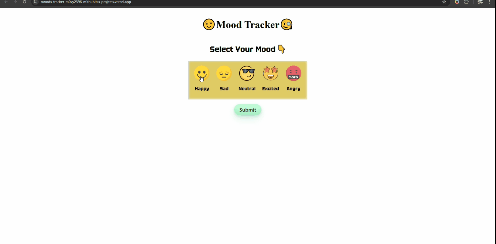

# Mood Tracker App

# Mood Tracker Application

This is a simple **Mood Tracker** web application where users can select their current mood, view motivational quotes based on the selected mood, and store their mood history. The application allows users to see their past moods, along with the corresponding date and time.

## Features

- Mood Selection: Users can select one mood from a list of predefined moods (happy, sad, neutral, excited, angry).
- Motivational Quotes: After selecting a mood, users will receive a motivational quote related to that mood.
- Time and Date: The current date and time are recorded along with the mood.
- Mood History: The application stores the user's mood history in local storage, allowing the history to persist even after the page is reloaded.
- Display Grid: The mood history is displayed in a grid format, showing the most recent mood first.

## Moods Available

- **Happy**: A motivational quote to inspire happiness.
- **Sad**: A motivational quote to alleviate sadness.
- **Neutral**: A motivational quote to encourage balance.
- **Excited**: A motivational quote to boost excitement.
- **Angry**: A motivational quote to calm down anger.

## How It Works

1. **Mood Selection**: Users select one mood from the options (happy, sad, neutral, excited, angry). Only one mood can be selected at a time.
2. **Submit Mood**: When the user submits the selected mood, a quote is displayed with the current date and time.
3. **View Mood History**: The user's mood history is displayed in a grid, showing all previous mood submissions, along with the date and time. The most recent mood appears first.
4. **Local Storage**: The mood and time data is stored in local storage, so it persists between page reloads.
